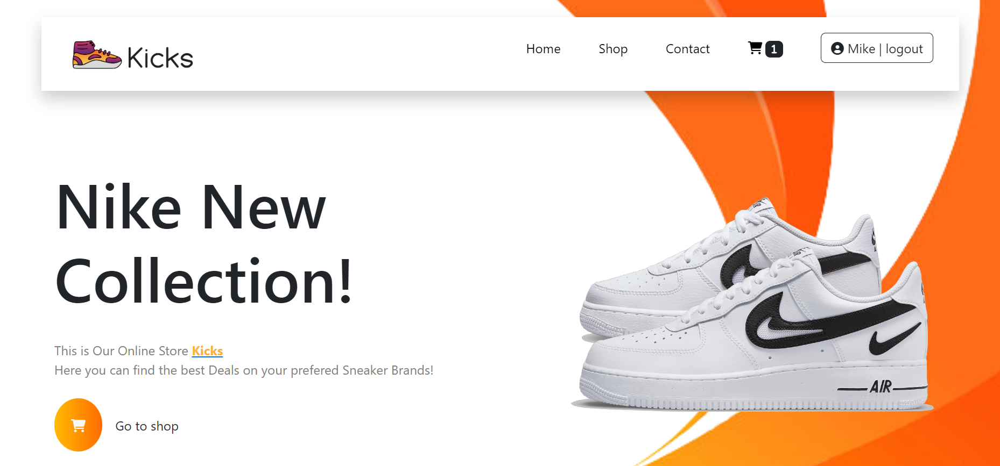
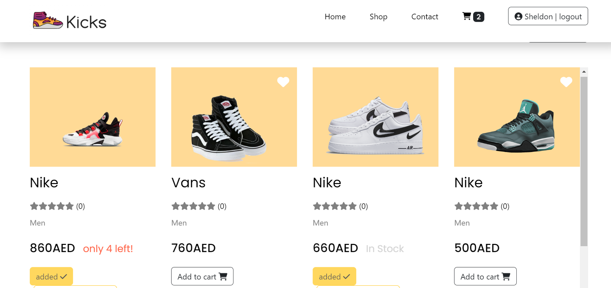
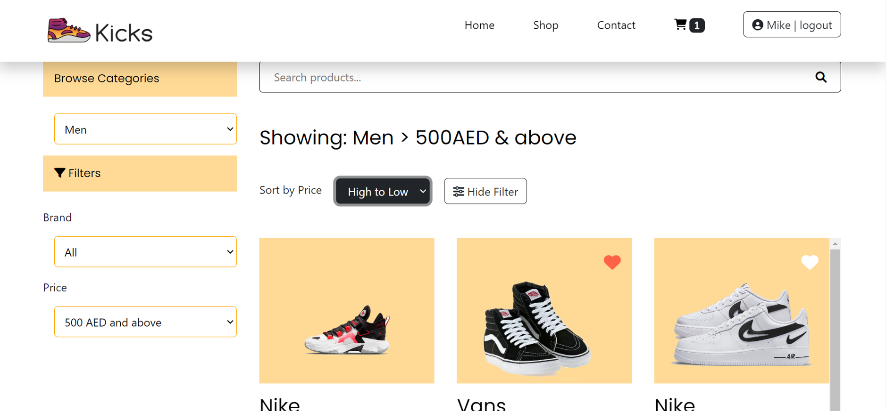
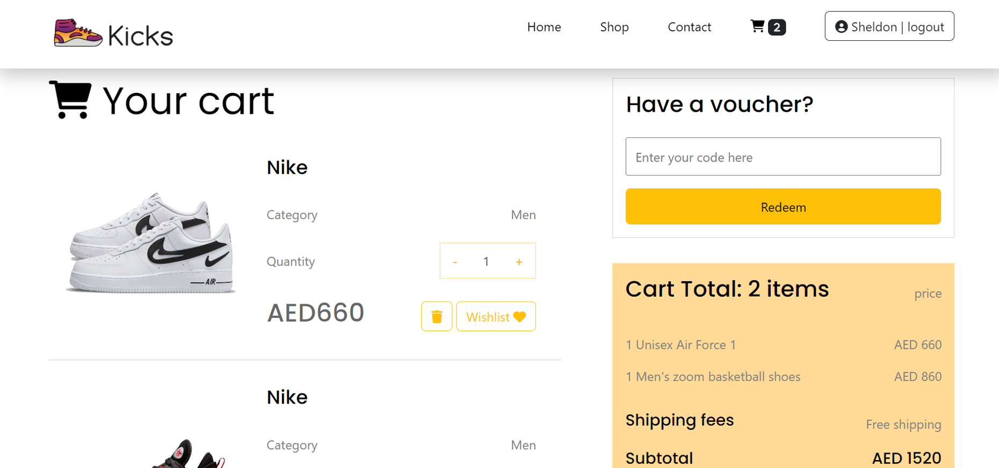
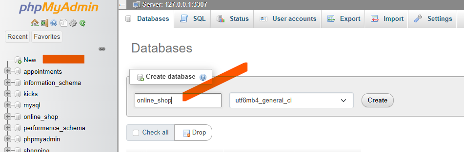
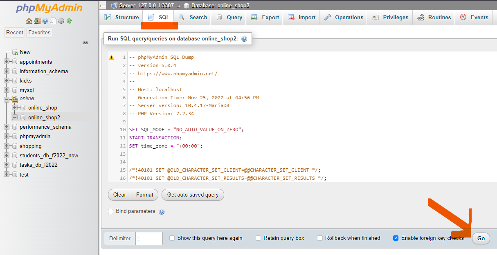
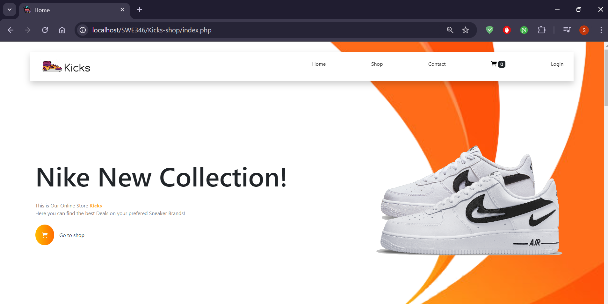

# Kicks Shop

Kicks Shop is an online e-commerce web application designed to simplify the shopping experience for customers. The platform offers a variety of shoe brands and provides a dynamic and responsive interface for users. The front-end is developed with HTML, CSS, and JavaScript, while the back-end is built using PHP. A relational database is managed using PHPMyAdmin, and data is rendered through AJAX requests.


## Features

### Home Page
- Displays the home page of the web application after successful login authentication.
- Includes a profile button with the user's name displayed.



### Shop Page
- Displays all available shoes in stock, categorized as in-stock and out-of-stock.
- Features product ratings based on user reviews.
- Allows users to add items to the wishlist and then move them to the cart or remove them from the cart.



### Browsing Feature
- Customers can apply filters including category (Men), brands of shoes, and price range.



### Adding items to Cart
- A customer can add shoes to cart and can checkout with total amount displayed.
- Users can also add items to wishlist and remove it from.

    

## Getting Started

### Prerequisites
- XAMPP Control Panel for Apache and MySQL
XAMPP is used to lauch apache and mysql services to lauch the app and access the sql server.
- Apache NetBeans


### Installation

1. Clone the repository:
   ```bash
   git clone https://github.com/siezer-5997/Kicks-shop.git
   ```

2. Navigate to the project directory:
   ```bash
   cd Kicks-shop
   ```

3. Set up the XAMPP Control Panel:
   - Open the Apache Friends website, The download and install XAMPP for Windows.
   - Open the XAMPP Program Control Panel and start “Apache Web Server”. (NB: If your PHP scripts need MySQL  database to work, Start “MySQL” service as well)
   - Start Apache and MySQL.

4. Configure the database in PHPMyAdmin:
   - Import the SQL file provided under `server/online_shop.sql`.
   - This SQL file creates a database named 'online_shop; and all the necessary tables within it. It also populates these tables with some initial data. 
   - Lauch the admin page from XAMPP control panel, to do that:
        1. Click on "Admin" next to MySQL
        2. Check if the database exists, if not
        3. Create a database called "online_shop" by clicking on New

        
        4. Enter "online_shop" as the database name and click create.
        4. Then navigate to SQL tab on the top 

        
        5. Copy and past the sql queries and Click Go

5. Launch the project using Apache NetBeans.
   - Create a new folder inside “htdocs” folder called Kicks-shop
   - Copy the cloned directory contents into the folder
   
   ``` bash
    Path looks like: C:/xampp/htdocs/Kicks-shop/
   ```
   - Lastly, lauch the application in the browser by typing
   ```bash
   localhost/Kicks-shop/index.php
   ```

   You will see the home page or index page:

   
   
## Usage
Once the setup is complete, you can access the web application locally and explore its features. 

## Contributing
Pull requests are welcome. For major changes, please open an issue first to discuss what you would like to change.

## License
This project is licensed under the MIT License.

## Contact
If you have any questions or need further assistance, feel free to contact me.
- **Email**: 📫 [siemzeresenay937@gmail.com](mailto:siemzeresenay937@gmail.com)
- **GitHub**: 🔗 [siezer-5997](https://github.com/siezer-5997)
---

Enjoy shopping with Kicks Shop!

